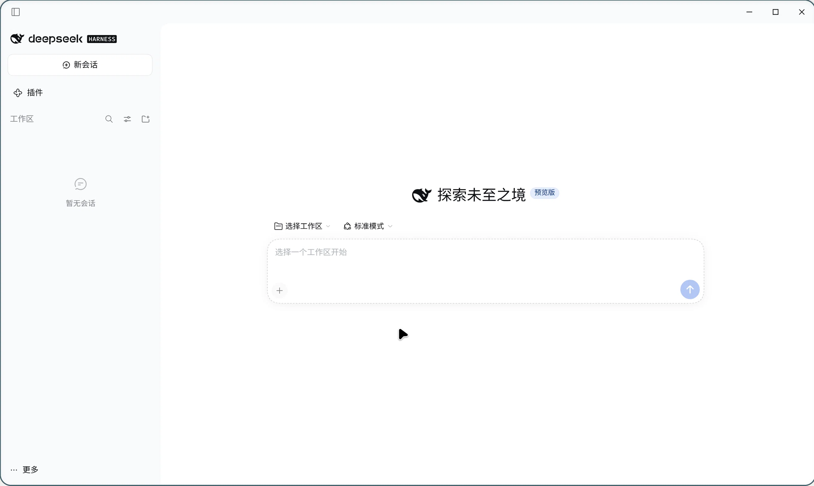

# dsh-desktop-linux

[中文](README.md) | **English**

> An independent community project. **Not** an official DeepSeek product, and not
> affiliated with DeepSeek.

Ports the **packaging pipeline** of the official
[DeepSeek Harness](https://github.com/deepseek-ai/deepseek-harness) desktop app
(the Electron application in `apps/desktop`) to Linux, producing
AppImage / deb / rpm / Arch packages.

Upstream explicitly does not support Linux today (`apps/desktop/README.md`:
*"Linux is not a supported Desktop release target."*). This project fills exactly
that gap: it teaches the official packaging pipeline about `linux-x64` and emits
installable artifacts. See [Validation status](#validation-status) for what has
actually been tested.



## How this fork differs from the original project

This repository is a fork of
[ffyfox/dsh-desktop-linux](https://github.com/ffyfox/dsh-desktop-linux), based on its `ccf89ae`:
the same upstream tag and the same patch series. **The packaging pipeline itself is unchanged** —
of patches `0001`–`0015` only `0003` is extended and the other 14 are byte-identical, and inside
`scripts/` only `verify.sh` gained assertions. What this fork adds:

| Change | Content |
|---|---|
| New patch `0016-desktop-linux-caption.patch` | A locally drawn Linux title bar: the main window drops its OS frame and reuses the same caption seat Windows gets from Window Controls Overlay (40 DIP band, drag region, sidebar and overlay clearance), with minimize / maximize / close drawn in the preload. The original project's Linux artifacts use the system title bar |
| Patch `0003` extended | The deb and rpm packages declare `libdbusmenu-glib.so.4`, which the tray menu needs. The original project only declared it in the Arch PKGBUILD `depends`, so an installed deb/rpm could show the tray icon with an empty menu |
| `scripts/verify.sh` | Two artifact assertions (the main process's dropped frame and window control channel, and the preload's caption module) that catch "source changed but `build:official` was not rerun" |
| `PKGBUILD` | `source` / `sha256sums` gain `0016` and the new `0003` hash; `pkgrel` 1→2 because the upstream tag did not move and only the packaging side changed — the same handling the original project applied for `0015` |
| Documentation | The title bar behavior, plus two measured known limitations: a frameless window gets no native menu bar (so "About" and "Check for Updates" have no entry point), and a third-party plugin carrying a NAN native module built for Electron segfaults the Host, which surfaces as a silent `dsh desktop host stopped` |

Tracking upstream works exactly as in the original project: `scripts/fetch-upstream.sh` fetches the
commit `PKGBUILD`'s `_tag` names and patches are generated against it. This fork forked no build
logic, so moving to a newer upstream release is still just redoing the patches.

## What this project produces

What this project ships is **the official Electron application itself**:

- the renderer loads over its own `dsh-app://` protocol rather than connecting to a local web server;
- it carries its own Node / pnpm / Python runtime and does not use the system Node;
- it owns `$DSH_HOME/profiles/desktop` exclusively and does not touch the `web` profile.

The cost is a much heavier build: clone the upstream monorepo, run the pnpm
workspace build, then package with electron-builder.

## Install

| Distribution | Format | How |
|---|---|---|
| Any | AppImage | Download from [Releases](https://github.com/ffyfox/dsh-desktop-linux/releases), `chmod +x`, run it |
| Debian / Ubuntu | deb | `sudo apt install ./deepseek-harness-*.deb` |
| Fedora / RHEL | rpm | `sudo dnf install ./deepseek-harness-*.rpm` |
| Arch Linux | PKGBUILD | Shipped in the repo, built locally with `makepkg` (not published to the AUR) — see [Arch package](#arch-package) |

Artifacts are **unsigned** builds (the file name carries `-unsigned`). Once
installed, `dsh://` links are handed to it.

## Building from source

Requirements: Node 22.19+ or 24+, **pnpm 11**, and git.
Building the rpm additionally needs `rpmbuild` on the system.

```bash
git clone https://github.com/ffyfox/dsh-desktop-linux
cd dsh-desktop-linux

./scripts/fetch-upstream.sh      # fetch upstream sources (defaults to the tag pinned in PKGBUILD)
./scripts/apply-patches.sh       # apply the patch series
./scripts/build.sh --all         # AppImage + deb + rpm
./scripts/verify.sh --runtime    # verification matrix
```

`build.sh` flags: `--dir` (unpacked directory only, fastest), `--appimage`
(default), `--deb`, `--rpm`, `--all`. The long pole is the pipeline itself
(`build:official` → `release:pack` → `prepare:*` → `package`); each extra format
only adds one fpm/AppImage packaging pass, so building formats separately is both
faster and easier to debug.

Artifacts land in
`upstream/apps/desktop/.desktop-build/targets/linux-x64/unsigned-artifacts/`.

The deb / rpm `Maintainer:` / `Homepage:` come from `upstream/apps/desktop/.env.linux`.
`build.sh` creates it on first run from the repo's `.env.linux.example`, values already filled in.
To change them, edit that file: **the same-named environment variables are filtered out by
upstream**, so `DSH_DESKTOP_LINUX_MAINTAINER=… build.sh --deb` is silently ignored.

### Hard requirement

**pnpm 11 is required.** The upstream repository declares
`packageManager: pnpm@11.7.0`, and pnpm 11 switches to that version by itself.
pnpm 9 fails `pnpm install` with `ERR_PNPM_LOCKFILE_CONFIG_MISMATCH`.

## Arch package

The PKGBUILD consumes upstream's release tarball and does not depend on the
`./upstream` checkout:

```bash
./scripts/pkgbuild-dir.sh     # flatten into ./pkgbuild
cd pkgbuild && makepkg -si
```

This project is not published to the AUR; the PKGBUILD is for local builds only.

The Arch package installs the unpacked tree into `/opt/deepseek-harness-desktop`
and symlinks `/usr/bin/deepseek-harness`.

## How it works

```
Official Electron shell (apps/desktop)
├── renderer ──── dsh-app:// protocol ──── application UI
└── Host process ─── real Node from primary-runtime ─── bundled dsh runtime
                          └── $DSH_HOME/profiles/desktop
```

Three design points worth knowing:

- **The Host runs on a real Node, not Electron's node mode.** Under Electron's
  node mode `sharp` segfaults while decoding, so on Linux the Host uses the Node
  bundled in primary-runtime. Consequently **Linux artifacts do not put the dsh
  tree into an asar** (a real Node cannot read inside an archive), which is why
  `linux-unpacked` is large.
- **The profile is exclusive.** The desktop uses `$DSH_HOME/profiles/desktop`, and
  the CLI rejects that profile at the argument layer
  (`error: profile "desktop" is managed exclusively by the Electron application`).
  Sessions, settings, and credentials still live at the root of `$DSH_HOME`,
  shared with the CLI.
- **Sandboxing.** Where the kernel supports unprivileged user namespaces, the
  renderer runs in a namespace sandbox (separate user namespace + seccomp); only
  where it does not does it fall back to a setuid `chrome-sandbox`. The AppImage
  leaves this to AppRun's own probe, and the deb / rpm / Arch packages make the
  same decision in their postinst.

### Closing, the tray, and quitting

**Closing the window is not quitting — that is upstream's design.** Upstream
`main.ts` intercepts the main window's `close` and hides it instead: the Host keeps running, tasks
are not interrupted, and session write locks are not released (one kernel flock per session, with
deliberately no expiry). So after a close, another DSH instance — a terminal `dsh web`, say — that
opens the same session gets the official message "This session is already in use, possibly by
another running DSH instance … Quit other running DSH instances and try again."

Upstream provides two ways back to a hidden window, but what its documentation covers is the Windows
tray and the macOS Dock; **Linux had neither.** Patch `0013` adds the tray: the icon stays for the
whole run and carries a tray menu. The tray menu's "Quit" goes through the same confirmation as
`Ctrl+Q` (it asks first when the Host has running or scheduled tasks).

- The tray menu opens on a right click.
- To really quit: the tray menu's "Quit" or `Ctrl+Q`.
- To get the window back: launch the application again (a second launch only focuses the instance
  that is already running).

**The title bar is drawn locally too (patch `0016`).** Electron carries no Window Controls Overlay on
Linux, and upstream wrote a title bar for Windows and macOS only, so the main window drops its OS
frame and uses the same caption seat Windows receives from that overlay: a 40 DIP band with the
minimize / maximize / close controls on the right (they follow the light and dark theme) and a drag
region everywhere else, so holding an empty spot moves the window. "Close" means the same as the
system close button — hide the window, not quit.

A frameless window never gets a native menu bar: that is Electron's behavior (`RootView::SetMenu`
returns early for frameless windows), not something this project hides, and Alt cannot bring it back.
**So "About" and "Check for Updates" have no entry point in the UI**; see
[Known limitations](#known-limitations).

## Validation status

**Only a few environments have been tested so far, and we intend to widen that coverage.**
Both tables below are kept up to date as reports come in — please tell us how it goes in
[Issues](https://github.com/ffyfox/dsh-desktop-linux/issues), whether it works or not.

### Environment

| Environment | Status |
|---|---|
| Arch Linux · KDE Plasma 6 · Wayland · x86_64 | **Tested**, works |
| Ubuntu 26.04 LTS · GNOME 50 · Wayland · x86_64 | **Tested**, works (Ubuntu ships the tray host) |
| Debian 13 · GNOME 48 · Wayland · x86_64 | **Tested**, works (the tray needs an extra extension, see [Known limitations](#known-limitations)) |
| Fedora 44 Workstation · GNOME 50 · Wayland · x86_64 | **Tested**, works (the tray needs an extra extension, see [Known limitations](#known-limitations)) |
| Other distributions (Linux Mint / CachyOS, …) | Not tested |
| Other desktops / WMs (Xfce / Hyprland, …) | Not tested |
| X11 | Not tested |
| aarch64 | Not built, not tested |

### Artifacts

| Artifact | Status |
|---|---|
| AppImage | **Tested**: `chmod +x` → launch → tray, window close → quit |
| deb | **Tested**: `apt install` → launch → tray, window close → quit |
| rpm | **Tested**: `dnf install` → launch → tray, window close → quit |
| Arch package | **Tested**: `makepkg` → `pacman -U` → launch, sandbox, uninstall |
| `linux-unpacked` | **Tested**: `verify.sh --runtime` live matrix |

## Known limitations

- **No native menu bar, so "About" and "Check for Updates" have no entry point in the UI.** The local
  title bar (patch `0016`) makes the main window frameless, and Electron draws no menu bar in a
  frameless window (`RootView::SetMenu` returns early, and Alt cannot reveal it either); the title
  bar carries no Application / Edit menu. Quitting is still available from the tray menu and
  `Ctrl+Q`, and accelerators such as `Ctrl+C` / `Ctrl+V` come from the application menu, so they keep
  working.
- **The three title bar buttons have English tooltips.** Windows draws its caption buttons and gets
  the wording localized from the system; this one is drawn locally.
- **A third-party plugin with a native module built for Electron stops the whole desktop app.** The
  Linux Host runs on the bundled Node 24.21 (ABI 137), not Electron's node mode, so a **NAN** native
  module compiled for Electron (NAN is not ABI-stable) loads and then segfaults on first call. The app
  reports that it could not start or stopped unexpectedly, the terminal shows only
  `dsh desktop host stopped`, and stderr is empty — a segfault carries no JavaScript stack. Observed
  with `@linxin666/dsh-ssh` → `ssh2` → `cpu-features` (its `build/config.gypi` records
  `node_module_version: 149` while the Host is 137). Crash reports land in
  `~/.config/@deepseek-ai/dsh-desktop/logs/crash-*-host.log`. Recovery only touches that native
  module: move it aside
  (`mv ~/.dsh/profiles/desktop/node_modules/cpu-features{,.disabled}`, and `ssh2` falls back to its
  JavaScript implementation) or rebuild it for the local Node
  (`npm rebuild cpu-features --build-from-source`); the plugin itself can stay enabled.
- **GNOME shows no tray by default — install the extension yourself.** The tray uses freedesktop
  StatusNotifierItem, and GNOME ships no host for it, so you need `gnome-shell-extension-appindicator`
  (Ubuntu installs it by default; Debian needs its own `apt install` and Fedora its `dnf install`).
  Two traps after installing: the extension's UUID is `ubuntu-appindicators@ubuntu.com` (that is the
  name in Debian 13's 59-4 —
  the `appindicatorsupport@rgcjonas.gmail.com` of older docs is obsolete), and **newly installed
  extensions are not hot-loaded**, so you must log out and back in. Without a tray host the icon never
  appears, and a hidden window can then only be recovered by launching the application again.
- **The AppImage needs FUSE 2 (`libfuse.so.2`) on the system.** Mainstream distributions now install
  only FUSE 3 (Debian 13, Ubuntu 26.04 and Fedora 44 all ship just `libfuse3.so.3`), so running it
  stops at `dlopen(): error loading libfuse.so.2`. Install the matching package — Fedora
  `sudo dnf install fuse-libs`, Debian 13 and Ubuntu 24.04+ `sudo apt install libfuse2t64`
  (`libfuse2` on Ubuntu 22.04) — or bypass the mount with
  `APPIMAGE_EXTRACT_AND_RUN=1 ./deepseek-harness-*.AppImage` (extracts to /tmp, about 1.2G extra).
  The deb, rpm and Arch packages are unaffected.
- **Electron is newer than the version upstream's lockfile pins (44.4.5).** Upstream's
  `apps/desktop/package.json` says `^44.0.0`, which the caret already allows, but its lockfile pins
  the resolution to 44.0.0 — and that version's **tray item registers on neither KDE nor GNOME**
  (upstream regression [electron#53213](https://github.com/electron/electron/issues/53213), fixed by
  [electron#53214](https://github.com/electron/electron/pull/53214) only on 2026-08-26, while 44.0.0
  was released on 08-25). Patch `0014` resolves the lockfile to 44.4.5; the cost is that Linux
  artifacts carry a slightly newer Chromium than upstream's desktop releases.
- **No auto-update.** Upstream's mandatory-update policy channel only recognises
  `desktop-win` / `desktop-mac` client identities, and Linux artifacts carry no
  update channel, so the Linux build embeds no policy, never polls, and never
  updates itself.
- **No "install the command line tool" entry.** The official desktop offers one on macOS and Windows:
  it puts the bundled `dsh` CLI on your PATH (a privileged symlink at `/usr/local/bin/dsh` on macOS, a
  user PATH edit on Windows), and upstream implements only those two branches, so the Linux artifacts
  have none. To use `dsh` in a terminal, install it yourself, or run the copy the application ships
  (`resources/app/dsh/node_modules/@deepseek-ai/dsh/lib/bin.js`, with the node under
  `resources/runtime/primary-runtime`).
- **Unsigned.** Artifacts are unsigned builds.
- **Platform sees a Linux client as macOS.** Upstream maps client identity with
  `platform === 'win32' ? 'desktop-win' : 'desktop-mac'`, so Linux lands on
  `desktop-mac`. That follows from upstream's `'darwin' | 'win32' | null` union
  and is not introduced here; the same request reports `device_model` as
  `linux-x64`.
- **`linux-unpacked` is about 1.1G.** With asar disabled it is a tree of small
  files; the AppImage compresses it to 339M, but first launch reads more files
  than an asar build would.
- **x86_64 only.**

## License

MIT
